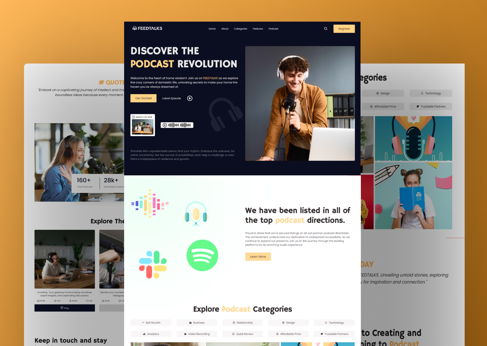

# FeedTalks Podcast Website

Welcome to the FeedTalks Podcast Website repository! This project is a responsive website dedicated to podcasts, created with HTML, CSS, and JavaScript. It incorporates animations, multiple sections, and a modern UI design for an engaging user experience.

## Preview



## Features

- **Responsive Design:** Ensures an optimal viewing experience on various devices.
- **Animations:** Engage users with subtle and modern animations throughout the website.
- **Multiple Sections:** Explore different segments, episodes, and information about the podcast.
- **Modern UI Design:** Sleek layout and visually appealing design for a seamless user interface.

## Demo

Check out the live demo of the FeedTalks Podcast Website [https://devsethi3.github.io/Feedtalks-Podcast-Website/](#).

## Getting Started

To explore this podcast website locally, follow these steps:

1. Clone the repository to your local machine:

   ```bash
   git clone https://github.com/Devsethi3/Feedtalks-Podcast-Website.git
   ```

2. Open the `index.html` file in your preferred web browser.

## Contributing

If you'd like to contribute to this project, follow these steps:

1. Fork the repository.
2. Create a new branch for your feature or improvement.
3. Make your changes and commit them with descriptive messages.
4. Push your changes to your forked repository.
5. Open a pull request to merge your changes into the main branch.

Explore the FeedTalks Podcast Website, provide feedback, and consider contributing to its development. Thank you for checking out the repository!